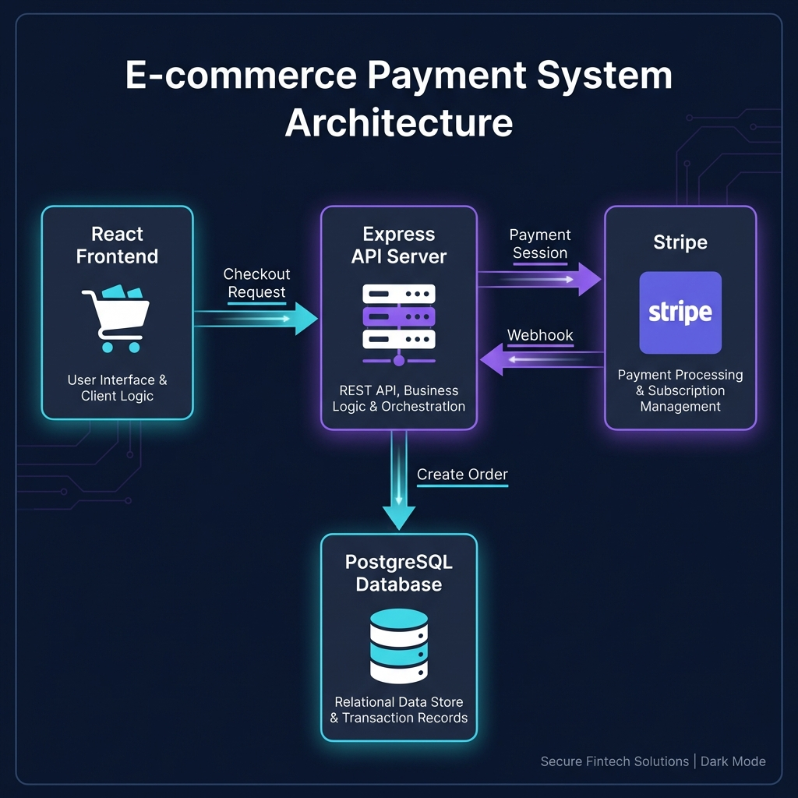

# EcomSync - E-commerce Payment Integration

A modern e-commerce application with **Stripe payment integration**, demonstrating senior-level backend engineering patterns for fintech applications.



## Features

- 🛒 **React Storefront** - Dark theme UI with responsive design
- 💳 **Stripe Checkout** - Secure hosted payment page
- 🔒 **Webhook Security** - HMAC signature verification
- 🔄 **Idempotency** - Prevents duplicate charges on retries
- 📊 **Order Tracking** - PostgreSQL with state machine (PENDING → PAID)
- ⚡ **TypeScript Backend** - Express with proper error handling

## Architecture

```
┌─────────────────┐     ┌─────────────────┐     ┌─────────────────┐
│  React Frontend │────▶│  Express API    │────▶│     Stripe      │
│   (Port 3001)   │     │   (Port 4000)   │◀────│   Webhooks      │
└─────────────────┘     └────────┬────────┘     └─────────────────┘
                                 │
                                 ▼
                        ┌─────────────────┐
                        │   PostgreSQL    │
                        │   (Orders DB)   │
                        └─────────────────┘
```

## Quick Start

### Prerequisites
- Node.js 18+
- PostgreSQL (local or Docker)

### 1. Clone and Install

```bash
git clone https://github.com/seifedd/EcomSync-API-Integration.git
cd EcomSync-API-Integration

# Install frontend dependencies
cd store && npm install

# Install backend dependencies
cd ../server && npm install
```

### 2. Set Up Database

```bash
# Create database (macOS with Postgres.app or Homebrew)
createdb ecomsync

# Or use Docker
cd server && docker compose up -d

# Run migrations
cd server && npx prisma db push
```

### 3. Configure Environment

```bash
# Copy example env
cp server/.env.example server/.env

# Update with your values (test keys work out of the box)
```

### 4. Start the Application

```bash
# Terminal 1: Start backend
cd server && npm run dev

# Terminal 2: Start frontend
cd store && npm start
```

Open **http://localhost:3001** to view the store.

## Testing Checkout

1. Add items to cart
2. Click "Purchase items!"
3. Use test card: `4242 4242 4242 4242` (any future expiry, any CVC)
4. Check `/success` redirect

## API Endpoints

| Method | Endpoint | Description |
|--------|----------|-------------|
| POST | `/api/create-checkout-session` | Creates Stripe checkout session |
| POST | `/api/webhooks/stripe` | Receives Stripe webhooks |
| GET | `/api/health` | Health check |

## Project Structure

```
├── store/                  # React frontend
│   ├── src/
│   │   ├── components/     # Navbar, ProductCard, CartProduct
│   │   └── pages/          # Store, Success, Cancel
│   └── public/
│
├── server/                 # TypeScript backend
│   ├── src/
│   │   ├── controllers/    # checkout, webhook handlers
│   │   ├── services/       # stripe, order business logic
│   │   └── middleware/     # error handling, raw body
│   └── prisma/             # Database schema
│
└── docs/                   # Documentation assets
```

## Fintech Engineering Patterns

| Pattern | Implementation |
|---------|---------------|
| **Idempotency** | UUID keys prevent duplicate charges |
| **Decoupled Fulfillment** | Orders fulfilled on webhook, not API response |
| **Atomic Transactions** | Prisma transactions keep DB in sync |
| **Webhook Security** | HMAC verification prevents forged events |

## Documentation

- [Server README](server/README.md) - Backend setup details
- [Deployment Guide](server/DEPLOYMENT.md) - Production checklist

## Tech Stack

- **Frontend**: React, React-Bootstrap, React Router
- **Backend**: TypeScript, Express, Prisma ORM
- **Database**: PostgreSQL
- **Payments**: Stripe Checkout

## License

MIT
